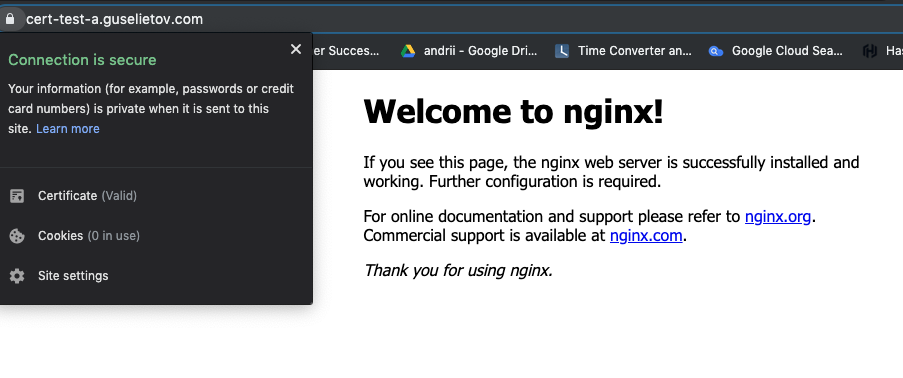
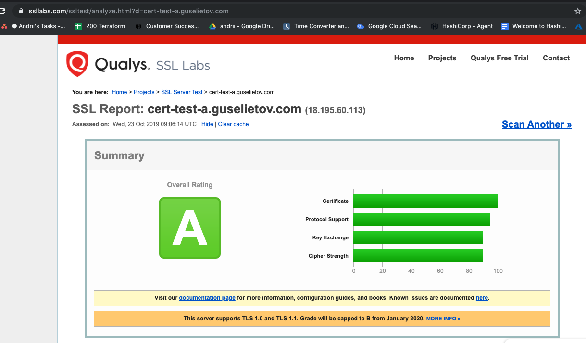

# sm200-nginx-cert-valid-test
Skills map 200 Terraform - create fqdn dns entry and get a valid ssl cert - configure a nginx web, test certificate works - padlock closes


# Purpose
We aiming to create FQDN dns entry and get a valid ssl cert applied in running Nginx server machine, the test wit closed padlock in browser should pass. 

The repository assumes some preliminary knowledge about Terraform, Nginx, SSL, AWS plus some tools. To find out about the different technologies used here please check section [Technologies](#technologies)


# Notes 

See also the native way of creating certificates through TF ACME provider here : https://github.com/Galser/tf-acme-provisioner-tests,
that is not working as of 23 Oct 2019 with production certificates. 

# Walk-through

- Register and export as env variables GoDaddy API keys. 
    - Use this link : https://developer.godaddy.com/keys/ ( pay attention that you are creating API KEY IN **production** area)
    - Export them via : 
    ```bash
    export GODADDY_API_KEY=MY_KEY
    export GODADDY_API_SECRET=MY_SECRET
    ```
- Install GoDaddy plugin :  https://github.com/n3integration/terraform-godaddy
    - Run : 
    ```bash 
    bash <(curl -s https://raw.githubusercontent.com/n3integration/terraform-godaddy/master/install.sh)
    ```
    - This is going to create plugin binary in `~/.terraform/plugins` , while the recommended path should be `~/.terraform.d/plugins/`, and the name should be in a proper format pattern . let's move and rename it : 
    ```bash
    mv ~/.terraform/plugins/terraform-godaddy ~/.terraform.d/plugins/terraform-provider-godaddy
    ```
- Terraform code to create record : 
    - [main.tf](main.tf)
    ```terraform
    resource "godaddy_domain_record" "our_site_record" {
        domain   = var.site_domain

        record {
            name = var.site_record
            type = "A"
            data = "192.168.1.2"
            ttl = 3600
        }
    }
    ```
    [variables.tf](variables.tf)
    ```terraform
    variable "site_record" {
        default = "cert-test-a"
    }

    variable "site_domain" {
        default = "guselietov.com"
    }
    ```
    [provider_godaddy.tf](provider_godaddy.tf)
    ```terraform
    provider "godaddy" { }    
    ```
- Init Terraform : 
    ```
    terraform init
    ```
- Run apply to use our initial config :
    ```bash
    $ terraform apply                

    An execution plan has been generated and is shown below.
    Resource actions are indicated with the following symbols:
    + create

    Terraform will perform the following actions:

    # godaddy_domain_record.our_site_record will be created
    + resource "godaddy_domain_record" "our_site_record" {
        + domain = "guselietov.com"
        + id     = (known after apply)

        + record {
            + data     = "192.168.1.2"
            + name     = "cert-test-a"
            + priority = 0
            + ttl      = 3600
            + type     = "A"
            }
        }

    Plan: 1 to add, 0 to change, 0 to destroy.

    Do you want to perform these actions?
    Terraform will perform the actions described above.
    Only 'yes' will be accepted to approve.

    Enter a value: yes

    godaddy_domain_record.our_site_record: Creating...
    godaddy_domain_record.our_site_record: Creation complete after 5s [id=266392926]
    ```
- Check the record : 
    ```bash
    host cert-test-a.guselietov.com
    cert-test-a.guselietov.com has address 192.168.1.2
    ```
- Note, with the consqunet applys used mdule will try to remove some GoDaddy's default records, that can be solved with `import` feature, which unfortunately , again for this module is not stable yet. So, as workaround we can run first :
    ```
    terraform plan
    ```
    - See what recods are about to be changed/remove : 
    ```terraform
        - record {
            - data     = "@" -> null
            - name     = "www" -> null
            - priority = 0 -> null
            - ttl      = 3600 -> null
            - type     = "CNAME" -> null
            }
        - record {
            - data     = "_domainconnect.gd.domaincontrol.com" -> null
            - name     = "_domainconnect" -> null
            - priority = 0 -> null
            - ttl      = 3600 -> null
            - type     = "CNAME" -> null
            }
    ```
    - And convert that into our domain records description in [main.tf](main.tf) as follows : 
    ```terraform

    resource "godaddy_domain_record" "our_site_record" {
    domain = var.site_domain

    record {
        name = var.site_record
        type = "A"
        data = "192.168.1.2"
        ttl  = 3600
    }

    record {
        data     = "@"
        name     = "www"
        priority = 0
        ttl      = 3600
        type     = "CNAME"
    }

    record {
        data     = "_domainconnect.gd.domaincontrol.com"
        name     = "_domainconnect"
        priority = 0
        ttl      = 3600
        type     = "CNAME"
    }
    }
    ```
    > Note : Later we are going to move this chunk of code into separate file
- Moving out DNS GoDaddy code out to a separate file : [dns_godaddy.tf](dns_godaddy.tf)
- Adding instance provisioning : 
    ```terraform
    resource "aws_key_pair" "tf200-nginxweb-key" {
    key_name   = "tf200-nginxweb-key"
    public_key = "${file("~/.ssh/id_rsa.pub")}"
    }

    resource "aws_instance" "nginxweb" {
    ami                    = var.amis[var.region]
    instance_type          = "${var.instance_type}"
    subnet_id              = var.subnet_ids[var.region]
    vpc_security_group_ids = [var.vpc_security_group_ids[var.region]]
    key_name               = "${aws_key_pair.tf200-nginxweb-key.id}"

    connection {
        user        = "ubuntu"
        type        = "ssh"
        private_key = "${file("~/.ssh/id_rsa")}"
        host        = self.public_ip
    }

    provisioner "remote-exec" {
        inline = [
        "sudo apt update -y",
        "sudo apt install -y nginx",
        "sudo ufw allow 'Nginx Full'",
        "sudo ufw delete allow 'Nginx HTTP'"
        ]
    }
    }

    ```
- Testing provision
- Adding certificate creation with [CertBot](https://certbot.eff.org/) 
> Note : Initial idea was to provision certificate with ACME provisioner of Terrafom, but, apparently as of this moment there is a bug
in provisioner that not allows to use it to create non-staging certificates, there is a separate repo dedicated to finding and fixing that bug : https://github.com/Galser/tf-acme-provisioner-tests
  Modifying [main.tf](main.tf) :
  ```terraform
  
    #.. adding to the instance code...

        provisioner "file" {
        content     = <<EOT
        server {
            server_name cert-test-a.guselietov.com;
            listen 80;

            root /var/www/html;

            index index.html index.htm index.nginx-debian.html;

            location / {
                    try_files $uri $uri/ =404;
            }

        }    
        EOT
        destination = "/tmp/${var.site_record}.${var.site_domain}.conf"
    }

    provisioner "remote-exec" {
        inline = [
        "sudo cp /tmp/${var.site_record}.${var.site_domain}.conf /etc/nginx/sites-available/",
        "sudo ln -s /etc/nginx/sites-available/${var.site_record}.${var.site_domain}.conf /etc/nginx/sites-enabled/",
        "sudo add-apt-repository ppa:certbot/certbot -y",
        "sudo apt install python-certbot-nginx -y",
        ]
    }

    tags = {
        "Name"      = "web-nginx",
        "andriitag" = "true",
    }
    
    #... addding later ...

    resource "null_resource" "nginxweb-cert" {
        # depends_on because we need first GoDaddy to register 
        # DNS record and cert bot going to use that for challenge/response
        depends_on = [ godaddy_domain_record.our_site_record ]

        # do we need triggers in some cases? 
        #triggers = {
        #    instance_ip = "${aws_instance.nginxweb.public_ip}" # trigger with every IP chaange
        #                    # this is not the best way though, but a solution for this project
        #}
        connection {
            user        = "ubuntu"
            type        = "ssh"
            private_key = "${file("~/.ssh/id_rsa")}"
            host        = "${aws_instance.nginxweb.public_ip}"
        }

        provisioner "remote-exec" {
            
            inline = [
            "sleep 30",
            "sudo certbot --nginx -d cert-test-a.guselietov.com --non-interactive --agree-tos -m andrii@guselietov.com",
            "sudo tar -czvf /tmp/lte.tgz /etc/letsencrypt/",
            "sudo tar -czvf /tmp/nginx.tgz /etc/nginx"
            ]
        }
    }
  ```
- Let's apply it : 
```bash
$ terraform init

aws_key_pair.tf200-nginxweb-key: Creating...
aws_key_pair.tf200-nginxweb-key: Creation complete after 1s [id=tf200-nginxweb-key]
aws_instance.nginxweb: Creating...
aws_instance.nginxweb: Still creating... [10s elapsed]
aws_instance.nginxweb: Still creating... [20s elapsed]
aws_instance.nginxweb: Still creating... [30s elapsed]
aws_instance.nginxweb: Provisioning with 'remote-exec'...
aws_instance.nginxweb (remote-exec): Connecting to remote host via SSH...
aws_instance.nginxweb (remote-exec):   Host: 18.195.60.113
aws_instance.nginxweb (remote-exec):   User: ubuntu
aws_instance.nginxweb (remote-exec):   Password: false
a
...
aws_instance.nginxweb (remote-exec): Reading state information... Done
aws_instance.nginxweb (remote-exec): The following additional packages will be installed:
aws_instance.nginxweb (remote-exec):   certbot python3-acme python3-certbot
...

rogress: [ 97%] [#################.]Setting up python-certbot-nginx (0.31.0-1+ubuntu18.04.1+certbot+1) ...
Progress: [ 99%] [#################.]Processing triggers for man-db (2.8.3-2ubuntu0.1) ...
...

aws_instance.nginxweb: Creation complete after 1m26s [id=i-0debead0e8d495a61]
godaddy_domain_record.our_site_record: Creating...
godaddy_domain_record.our_site_record: Creation complete after 5s [id=266392926]
null_resource.nginxweb-cert: Creating...
null_resource.nginxweb-cert: Provisioning with 'remote-exec'...
null_resource.nginxweb-cert (remote-exec): Connecting to remote host via SSH...
null_resource.nginxweb-cert (remote-exec):   Host: 18.195.60.113
null_resource.nginxweb-cert (remote-exec):   User: ubuntu
null_resource.nginxweb-cert (remote-exec):   Password: false
null_resource.nginxweb-cert (remote-exec):   Private key: true
null_resource.nginxweb-cert (remote-exec):   Certificate: false
null_resource.nginxweb-cert (remote-exec):   SSH Agent: true
null_resource.nginxweb-cert (remote-exec):   Checking Host Key: false
null_resource.nginxweb-cert (remote-exec): Connected!
null_resource.nginxweb-cert: Still creating... [10s elapsed]
null_resource.nginxweb-cert: Still creating... [20s elapsed]
null_resource.nginxweb-cert: Still creating... [30s elapsed]
null_resource.nginxweb-cert (remote-exec): Saving debug log to /var/log/letsencrypt/letsencrypt.log
null_resource.nginxweb-cert (remote-exec): Plugins selected: Authenticator nginx, Installer nginx
null_resource.nginxweb-cert (remote-exec): Obtaining a new certificate
null_resource.nginxweb-cert (remote-exec): Performing the following challenges:
null_resource.nginxweb-cert (remote-exec): http-01 challenge for cert-test-a.guselietov.com
null_resource.nginxweb-cert (remote-exec): Waiting for verification...
null_resource.nginxweb-cert (remote-exec): Cleaning up challenges
null_resource.nginxweb-cert: Still creating... [40s elapsed]
null_resource.nginxweb-cert (remote-exec): Deploying Certificate to VirtualHost /etc/nginx/sites-enabled/cert-test-a.guselietov.com.conf

null_resource.nginxweb-cert (remote-exec): - - - - - - - - - - - - - - - - - - - - - - - - - - - - - - - - - - - - - - - -
null_resource.nginxweb-cert (remote-exec): Congratulations! You have successfully enabled
null_resource.nginxweb-cert (remote-exec): https://cert-test-a.guselietov.com

null_resource.nginxweb-cert (remote-exec): You should test your configuration at:
null_resource.nginxweb-cert (remote-exec): https://www.ssllabs.com/ssltest/analyze.html?d=cert-test-a.guselietov.com
null_resource.nginxweb-cert (remote-exec): - - - - - - - - - - - - - - - - - - - - - - - - - - - - - - - - - - - - - - - -
null_resource.nginxweb-cert (remote-exec): 
null_resource.nginxweb-cert (remote-exec): IMPORTANT NOTES:
null_resource.nginxweb-cert (remote-exec):  - Congratulations! Your certificate and chain have been saved at:
null_resource.nginxweb-cert (remote-exec):    /etc/letsencrypt/live/cert-test-a.guselietov.com/fullchain.pem
null_resource.nginxweb-cert (remote-exec):    Your key file has been saved at:
null_resource.nginxweb-cert (remote-exec):    /etc/letsencrypt/live/cert-test-a.guselietov.com/privkey.pem
null_resource.nginxweb-cert (remote-exec):    Your cert will expire on 2020-01-20. To obtain a new or tweaked
null_resource.nginxweb-cert (remote-exec):    version of this certificate in the future, simply run certbot again
null_resource.nginxweb-cert (remote-exec):    with the "certonly" option. To non-interactively renew *all* of
null_resource.nginxweb-cert (remote-exec):    your certificates, run "certbot renew"
null_resource.nginxweb-cert (remote-exec):  - Your account credentials have been saved in your Certbot
null_resource.nginxweb-cert (remote-exec):    configuration directory at /etc/letsencrypt. You should make a
null_resource.nginxweb-cert (remote-exec):    secure backup of this folder now. This configuration directory will
null_resource.nginxweb-cert (remote-exec):    also contain certificates and private keys obtained by Certbot so
null_resource.nginxweb-cert (remote-exec):    making regular backups of this folder is ideal.
null_resource.nginxweb-cert (remote-exec):  - If you like Certbot, please consider supporting our work by:

null_resource.nginxweb-cert (remote-exec):    Donating to ISRG / Let's Encrypt:   https://letsencrypt.org/donate
null_resource.nginxweb-cert (remote-exec):    Donating to EFF:                    https://eff.org/donate-le

null_resource.nginxweb-cert (remote-exec): tar: Removing leading `/' from member names
null_resource.nginxweb-cert (remote-exec): /etc/letsencrypt/
...
null_resource.nginxweb-cert (remote-exec): /etc/letsencrypt/.updated-ssl-dhparams-pem-digest.txt
null_resource.nginxweb-cert (remote-exec): tar: Removing leading `/' from member names
null_resource.nginxweb-cert (remote-exec): /etc/nginx/
null_resource.nginxweb-cert (remote-exec): /etc/nginx/modules-enabled/
null_resource.nginxweb-cert (remote-exec): /etc/nginx/modules-enabled/50-mod-http-xslt-filter.conf
...
null_resource.nginxweb-cert (remote-exec): /etc/nginx/snippets/snakeoil.conf
null_resource.nginxweb-cert (remote-exec): /etc/nginx/snippets/fastcgi-php.conf
null_resource.nginxweb-cert: Creation complete after 42s [id=7710355570707302330]

Apply complete! Resources: 4 added, 0 changed, 0 destroyed.

Outputs:

public_dns = ec2-18-195-60-113.eu-central-1.compute.amazonaws.com
public_ip = 18.195.60.113

```
Full log can be found here : [Full run log](full_run_log.txt)
- Some screenshots with tests : 
- Site "lock" is closed : 
  
- [Qualys SSL Report](https://www.ssllabs.com/ssltest/analyze.html?d=cert-test-a.guselietov.com) : 
  

The concludes the Walk-through block. Thank you


# Technologies

1. **To download the content of this repository** you will need **git command-line tools**(recommended) or **Git UI Client**. To install official command-line Git tools please [find here instructions](https://git-scm.com/book/en/v2/Getting-Started-Installing-Git) for various operating systems. 
2. **For managing infrastructure** we using Terraform - open-source infrastructure as a code software tool created by HashiCorp. It enables users to define and provision a data center infrastructure using a high-level configuration language known as Hashicorp Configuration Language, or optionally JSON. More you encouraged to [learn here](https://www.terraform.io). 
3. **This project for virtualization** uses **AWS EC2** - Amazon Elastic Compute Cloud (Amazon EC2 for short) - a web service that provides secure, resizable compute capacity in the cloud. It is designed to make web-scale cloud computing easier for developers. You can read in details and create a free try-out account if you don't have one here :  [Amazon EC2 main page](https://aws.amazon.com/ec2/) 
4. **Nginx stands apart - as it will be downloaded and installed automatically during the provision.** Nginx is an open source HTTP Web server and reverse proxy server.In addition to offering HTTP server capabilities, Nginx can also operate as an IMAP/POP3 mail proxy server as well as function as a load balancer and HTTP cache server. You can get more information about it  - check [official website here](https://www.nginx.com)  
5. **GoDaddy** - GoDaddy Inc. is an American publicly traded Internet domain registrar and web hosting company, headquartered in Scottsdale, Arizona, and incorporated in Delaware. More information here : https://www.godaddy.com/
6. **Let'sEncrypt** - Let's Encrypt is a non-profit certificate authority run by Internet Security Research Group that provides X.509 certificates for Transport Layer Security encryption at no charge. The certificate is valid for 90 days, during which renewal can take place at any time. You cna find out more on their [official page](https://letsencrypt.org/)


# TODO


# DONE
- [x] export GoDaddy keys/challenge responce
- [x] create domain entry
- [x] register certificate
- [x] create configuiration for deploying ec2-nginx machine
- [x] tune configuraiton to include certificate
- [x] update config

